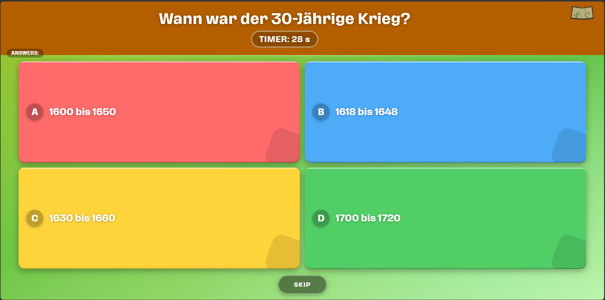
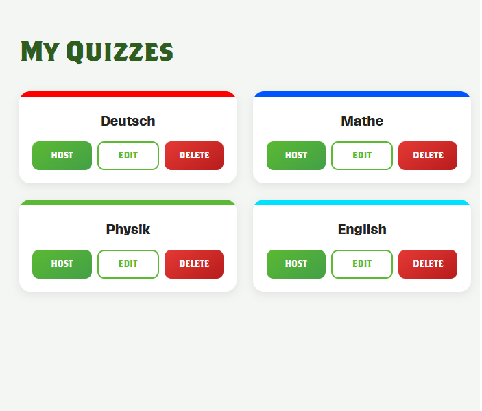
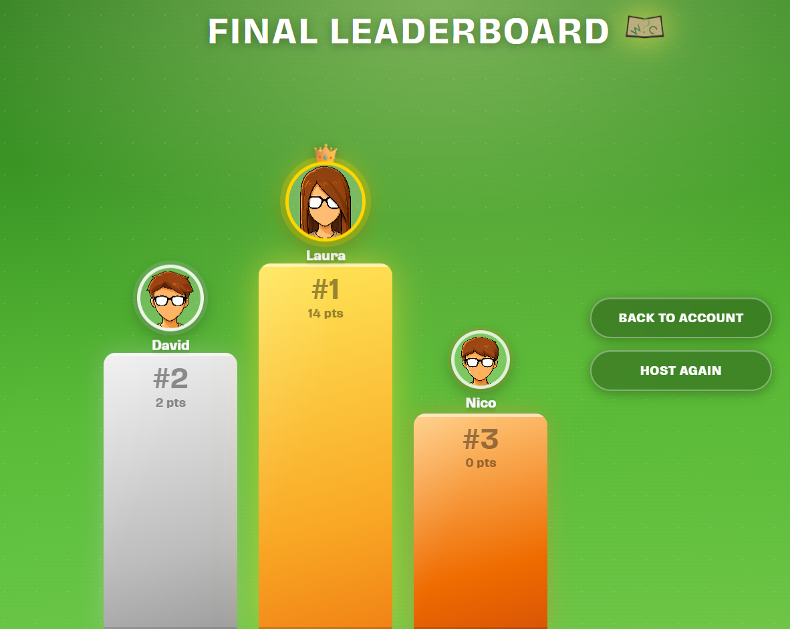

<div align="center">
  
  <h1>WitCheck</h1>
  <p>A real-time multiplayer quiz platform built with ASP.NET Core, Blazor and SignalR.</p>
</div>

---

## Preview

[](https://pub-908671fa2f5740e2bb5d5c75eac30440.r2.dev/WitCheckVorschauNew.mp4)
*Click the image to watch the demo video*

---

## What it does

WitCheck lets you host live quiz sessions for multiple players at the same time. A host creates a quiz, shares a lobby code, and players join from any browser. Questions are pushed in real time and everyone answers simultaneously. After each round the leaderboard updates live, and at the end the top three players are shown on a podium.

Quizzes support multiple choice and true/false questions. Hosts can build and manage their quiz library from their account, then start a session whenever they want.

---

## Screenshots

<table>
  <tr>
    <td></td>
    <td></td>
  </tr>
  <tr>
    <td align="center">Quiz management</td>
    <td align="center">Live question with timer</td>
  </tr>
  <tr>
    <td colspan="2" align="center"></td>
  </tr>
  <tr>
    <td colspan="2" align="center">Final leaderboard</td>
  </tr>
</table>

---

## Tech stack

**Backend** — ASP.NET Core 9, SignalR, Entity Framework Core, MySQL

**Frontend** — Blazor WebAssembly, nginx

**Infrastructure** — Docker, docker-compose

---

## How to run

The entire stack runs with a single command. Docker and Docker Compose are the only requirements.

```bash
docker compose up
```

Once the containers are ready:

| Service | URL |
|---------|-----|
| Web UI | http://localhost:5049 |
| API | http://localhost:5203 |

The database is initialized automatically on first start using the included SQL script.

---

## Architecture

```
WitCheck/
├── APIServer/      ASP.NET Core API with SignalR hubs and REST controllers
├── WebGUI/         Blazor WASM frontend served via nginx
├── Database/       Entity Framework Core, repositories and entities
├── APICaller/      HTTP + SignalR client library
├── Shared/         DTOs and builder used across projects
└── docker-compose.yml
```
